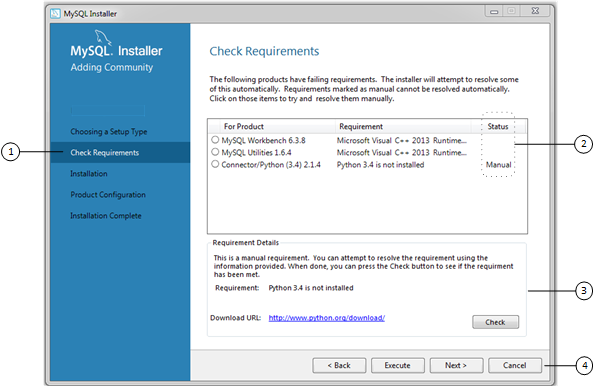

# MySQL 安装程序初始设置

- [选择设置类型](/2/2.3/2.3.3/2.3.3.1/mysql-installer-setup?id=选择设置类型)
- [路径冲突](/2/2.3/2.3.3/2.3.3.1/mysql-installer-setup?id=路径冲突)
- [检查要求](/2/2.3/2.3.3/2.3.3.1/mysql-installer-setup?id=检查要求)
- [MySQL 安装程序配置文件](/2/2.3/2.3.3/2.3.3.1/mysql-installer-setup?id=MySQL-安装程序配置文件)

当您第一次下载 MySQL 安装程序时，安装向导会指导您完成 MySQL 产品的初始安装。如下图所示，初始设置是整个流程中的一次性活动。MySQL 安装程序在初始安装期间检测主机上安装的现有 MySQL产品，并将其添加到要管理的产品列表中。

图 2.7 MySQL 安装程序安装处理过程

MySQL 安装程序在初始设置期间将配置文件（稍后介绍）提取到主机的硬盘驱动器。尽管 MySQL 安装程序是一个32位应用程序，但它可以安装32位和64位二进制文件。

初始设置会在 `MySQL` 组下添加一个指向开始菜单的链接，点击 `开始`，`所有程序`，`MySQL`，`MySQL 安装程序` 来打开 MySQL 安装程序。

## 选择设置类型

在初始设置期间，系统会提示您选择要在主机上安装的 MySQL 产品。另一种选择是使用符合设置要求的预定设置类型。默认情况下，GA 和预发布产品都包含在下载和安装中，使用`开发者默认`、`仅客户端`和`完整`设置类型。选择`仅安装GA产品`选项，将产品集限制为仅在使用这些安装类型时包含 GA 产品。

选择以下安装类型之一仅决定初始安装，并不限制您以后安装或更新 Windows 版 MySQL 产品的能力：

- `开发者默认`：安装以下与 MySQL 应用程序开发互补的产品：

  - [MySQL Server](https://dev.mysql.com/doc/) (当你下载 MySQL 安装程序时选择安装的版本)
  - [MySQL Shell](https://dev.mysql.com/doc/mysql-shell/8.0/en/)
  - [MySQL Router](https://dev.mysql.com/doc/mysql-router/8.0/en/)
  - [MySQL Workbench](/31/workbench)
  - [Visual Studio 版 MySQL](https://dev.mysql.com/doc/visual-studio/en/)
  - [MySQL Connectors](https://dev.mysql.com/doc/index-connectors.html) (用于 .NET / Python / ODBC / Java / C++)
  - MySQL 文档
  - MySQL 示例

- `仅服务器`：只安装 MySQL Server。此安装类型安装在下载 MySQL 安装程序时选择的通用可用性（GA）或开发版本服务器。它使用默认的安装和数据路径。

- `仅客户端`：只安装最新的 MySQL 应用程序和 MySQL 连接器。此安装类型与`开发者默认`类型类似，只是它不包括 MySQL Server 或通常与服务器捆绑的客户端程序，如 [mysql](/4/4.5/4.5.1/mysql) 或 [mysqladmin](/4/4.5/4.5.2/mysqladmin)。

- `完整`：安装所有可用的 MySQL 产品。

- `自定义`：自定义设置类型使您能够从 [MySQL 安装程序目录](/2/2.3/2.3.4/2.3.3.4/mysql-installer-catalog-dashboard?id=产品目录)中筛选和选择单个 MySQL 产品。

  ?> **注意** 对于MySQL服务器版本8.0.20（及更早版本）、5.7 和 5.6，您用于运行 MySQL 安装程序的帐户可能没有足够的权限安装服务器数据文件，这可能会中断安装，因为无法执行 `ExecSecureObjects` MSI 操作。要继续，请在再次尝试安装服务器之前取消选择**服务器数据文件**功能。有关帮助，参阅[待安装的产品功能](/2/2.3/2.3.3/2.3.3.3/mysql-installer-workflow)）。
  MySQL Server 8.0.21（及更高版本）的功能树中删除了**服务器数据文件**复选框。

  使用`自定义`安装类型安装：

  - 通常的下载位置无法提供的产品或产品版本。目录包含所有产品版本，包括预发布（或开发）和GA之间的其他版本。
  - 使用替代安装路径、数据路径或两者的MySQL服务器实例。有关如何调整路径的说明，参阅[章节 2.3.3.2，“使用 MySQL 安装程序设置备用服务器路径”](/2/2.3/2.3.3/2.3.3.2/mysql-installer-change-path-proc)。
  - 在同一台主机上同时安装两个或多个 MySQL Server 版本（例如，5.6、5.7 和 8.0）。
  - 产品和功能的特定组合，不作为预先确定的设置类型提供。例如，您可以安装一个产品，例如 MySQL Workbench，而不是安装所有 Windows 客户端应用程序。

## 路径冲突

当主机上已存在要安装的产品的默认安装或数据文件夹（MySQL Server 必需）时，向导将显示 `Path Conflict（路径冲突）`步骤，以识别每个冲突，并使您能够采取措施避免新安装覆盖现有文件夹中的文件。只有当MySQL安装程序检测到冲突时，才能在初始设置中看到这一步。

要解决路径冲突，请执行以下操作之一：

- 从列表中选择产品以显示冲突选项。警告符号表示哪个路径冲突。使用“浏览”按钮选择新路径，然后单击 `Next（下一步）`。

- 单击 `Back（上一步）` 选择其他安装类型或产品版本（如果适用）。`Custom（自定义）`设置类型允许您选择单个产品版本。

- 单击  `Next（下一步）` 忽略冲突并覆盖现有文件夹中的文件。

- 删除现有产品。单击 `Cancel（取消）` 停止初始安装并关闭 MySQL 安装程序。从开始菜单再次打开 MySQL 安装程序，并使用 [MySQL 安装程序面板](/2/2.3/2.3.3/2.3.3.4/mysql-installer-catalog-dashboard?id=MySQL-安装程序面板)中的删除操作从主机中删除已安装的产品。

## 检查要求

MySQL 安装程序使用 `package-rules.xml` 文件，以确定主机上是否安装了每个产品的必备软件。当需求检查失败时，MySQL 安装程序将显示 `Check Requirements（检查需求）` 步骤，以帮助您更新主机。每次下载新产品（或版本）进行安装时，都会评估需求。下图确定并描述了该步骤的关键领域。

图 2.8 检查需求

### 检查要求元素说明

1. 显示初始设置中的当前步骤。根据主机上已安装的产品、必备软件的可用性以及主机上要安装的产品，此列表中的步骤可能会略有变化。

2. 按产品列出所有待定的安装要求，并显示如下状态：

- `Status（状态）` 列中的空白表示 MySQL 安装程序可以尝试下载并安装所需的软件。
- `Status（状态）` 列中的 `Manual（手动）` 一词表示必须手动满足要求。选择列表中的每个产品以查看其需求详细信息。

3. 详细描述了帮助您解决每个手动问题的要求。如果可能，会提供下载链接。下载并安装所需软件后，单击 `Check（检查）` 以验证是否满足要求。

4. 提供以下设置操作以继续：

- `Back（上一步）` - 返回上一步。此操作允许您选择不同的设置类型。
- `Execute（执行）` - 让 MySQL 安装程序尝试下载并安装所有项目所需的软件，而不需要手动状态。手动要求由您解决，并通过单击 `Check（检查）` 进行验证。
- `Next（下一步）` - 不要执行自动应用要求的请求，并在不包括未通过检查要求步骤的产品的情况下继续安装。
- `Cancel（取消）` - 停止安装 MySQL 产品。因为已经安装了 MySQL 安装程序，所以当您从开始菜单打开 MySQL 安装程序并从面板单击 `Add（添加）` 时，初始安装会再次开始。有关可用管理操作的描述，参阅[产品目录](/2/2.3/2.3.3/2.3.3.4/mysql-installer-catalog-dashboard?id=产品目录)。

## MySQL 安装程序配置文件

所有 MySQL 安装程序文件都位于 `C:\Program files（x86）` 和 `C:\ProgramData` 文件夹中。下表描述了将 MySQL 安装程序定义为独立应用程序的文件和文件夹。

?> **注意** 更新或卸载 MySQL 安装程序时，安装的 MySQL 产品既不会被更改，也不会被删除。

表 2.5 MySQL 安装程序配置文件

|文件或文件夹|描述|文件夹结构|
|--|--|--|
|`Windows 版 MySQL 安装程序`|此文件夹包含运行 MySQL 安装程序和 [MySQLInstallerConsole.exe](/2/2.3/2.3.3/2.3.3.5/MySQLInstallerConsole)，一个具有类似功能的命令行程序。|`C:\Program Files (x86)`|
|`Templates`|`Templates` 文件夹中每个版本的 MySQL 服务器都有一个文件。模板文件包含用于动态计算某些值的键和公式。|`C:\ProgramData\MySQL\MySQL 安装程序for Windows\Manifest`|
|`package-rules.xml`|此文件包含要安装的每个产品的先决条件。|`C:\ProgramData\MySQL\MySQL 安装程序for Windows\Manifest`|
|`produts.xml`|`products` 文件（或产品目录）包含可供下载的所有产品的列表。|`C:\ProgramData\MySQL\MySQL 安装程序for Windows\Manifest`|
|`Product Cache`|`Product Cache` 文件夹包含所有独立的 `.msi` 文件与完整软件包捆绑在一起，或随后下载。|`C:\ProgramData\MySQL\MySQL 安装程序for Windows`|

> [原文链接](https://dev.mysql.com/doc/refman/8.0/en/mysql-installer-setup.html)
