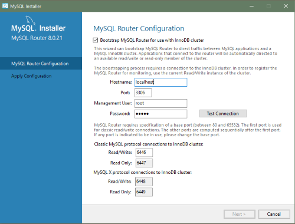

# 2.3.3.3 MySQL安装程序的安装工作流

MySQL 安装程序提供了一个类似向导的工具来为Windows安装和配置新的MySQL产品。与初始设置不同，MySQL安装程序只运行一次，每次下载或安装新产品时都会调用向导。对于首次安装，初始设置的步骤直接进入安装步骤。有关产品选择方面的帮助，请参阅查找要安装的产品。

::: tip 注意
执行 MySQL 安装程序的用户将被授予对所有生成文件的完全权限，如 `my.ini`。这不适用于特定产品的文件和目录，例如 `SYSTEM` 拥有的 `%ProgramData%` 中的 MySQL 服务器数据目录。
:::

在主机上安装和配置的产品遵循一种通用模式，在各个步骤中可能需要你的输入。如果你试图安装与现有 MySQL 服务器版本（或选择升级的版本）不兼容的产品，系统会提醒你可能存在不匹配。

MySQL 安装程序提供了适用于不同工作流的以下操作序列：

- **选择产品**。如果在初始设置期间选择了 `Custom（自定义）`设置类型，或者从[MySQL 安装程序面板](/2/2.3/2.3.3/2.3.3.4/mysql-installer-catalog-dashboard.html#MySQL-安装程序面板)中单击了**Add（添加）**，MySQL 安装程序会在侧栏中包含此操作。在此页面中，你可以应用过滤器来修改可用产品列表，然后选择一个或多个要移动（使用箭头键）到要安装的产品列表的产品。

选中此页面上的复选框可激活“选择功能”操作，在该操作中，你可以在下载产品后自定义产品功能。

- **下载**。如果你安装了完整的 MySQL 安装程序包（不是web），则所有 `.msi` 文件在初始设置期间已加载到 `Product Cache` 文件夹，不会再次下载。否则，单击 **Execute（执行）** 开始下载。每个产品的状态都会从 `Ready to Download（准备下载）` 变更为 `Downloading（正在下载）`，然后变更为 `Downloaded（已下载）`。

- **选择要安装的功能（默认禁用）**。MySQL 安装程序下载产品的 `.msi` 文件，如果之前在选择产品操作期间启用了可选复选框，则可以自定义功能。

要在安装后自定义产品功能，请单击 [MySQL 安装程序面板](/2/2.3/2.3.3/2.3.3.4/mysql-installer-catalog-dashboard.html#MySQL-安装程序面板)中的 **Modify（修改）**。

- **安装**。列表中每个产品的状态都会从 `Ready to Install（准备安装）`变更为 `Installing（正在安装）`，最后变更为 `Complete（完成）`。在此过程中，单击 **Show Details（展示详细信息）**以查看安装操作。

如果此时取消安装，则产品已安装，但服务器（如果已安装）尚未配置。要重新启动服务器配置，从开始菜单打开 MySQL 安装程序，然后单击面板中相应服务器旁边的 **Reconfigure（重新配置）**。

- **产品配置**。此步骤仅适用于 MySQL 服务器、MySQL 路由器和示例。列表中每个项目的状态都应指示 `Ready to Configure（待配置）`。单击 **Next（下一步）**启动列表中所有项目的配置向导。此步骤中提供的配置选项特定于你选择安装的数据库或路由器的版本。

单击 **Execute（执行）** 开始应用配置选项，或单击 `Back（上一步）**（可反复点击）返回到每个配置页面。

- **安装完成**。此步骤完成不需要配置的产品的安装。它使你能够将日志复制到剪贴板，并启动某些应用程序，例如 MySQL Workbench 和 MySQL Shell。单击 **Finish（完成）**打开 [MySQL 安装程序面板](/2/2.3/2.3.3/2.3.3.4/mysql-installer-catalog-dashboard.html#MySQL-安装程序面板)。

## 2.3.3.3.1 使用 MySQL 安装程序配置 MySQL 服务器

MySQL安装程序执行MySQL服务器的初始配置。例如：

- 它创建用于配置MySQL服务器的配置文件（`my.ini`）。写入此文件的值受安装过程中所做选择的影响。有些定义依赖于主机。例如，如果主机的内核少于三个，则会启用查询缓存。

  ::: tip 注意
  查询缓存在 MySQL 5.7 中被弃用，在 MySQL 8.0（及更高版本）中被删除。
  :::

- 默认情况下，会为 MySQL 服务器添加 Windows 服务。

- 提供 MySQL 服务器的默认安装和数据路径。有关如何更改默认路径的说明，参阅[章节 2.3.3.2，“使用 MySQL 安装程序设置其他服务器路径”](/2/2.3/2.3.3/2.3.3.2/mysql-installer-change-path-proc)。

- 它可以根据一般角色（如DB 管理员、DB 设计器和备份管理员）选择创建具有可配置权限的 MySQL 服务器用户帐户。它可以选择创建一个名为 `MysqlSys` 的 Windows 用户，该用户具有有限的权限，然后运行 MySQL 服务器。

还可以在 MySQL Workbench 中添加和配置用户帐户。

- 选中 **Show Advanced Options（显示高级选项）**可以设置其他 **Logging Options（日志选项）**。这包括为错误日志、常规日志、慢速查询日志（包括执行查询所需秒数的配置）和二进制日志定义自定义文件路径。

在配置过程中，单击 **Next（下一步）**继续下一步，或单击 **Back(上一步)**返回上一步。在最后一步单击 **Execute（执行）**以应用服务器配置。

下面几节介绍了适用于 Windows 上 MySQL 服务器的服务器配置选项。你安装的服务器版本将决定你可以配置哪些步骤和选项。配置 MySQL 服务器可能包括部分或全部步骤。

### 2.3.3.3.1.1 类型和网络

- 服务器配置类型
  选择描述设置的 MySQL 服务器配置类型。此设置定义要分配给 MySQL 服务器实例的系统资源（内存）量。
  - **Development（开发）**：承载许多其他应用程序的计算机，通常这是你的个人工作站。此设置将 MySQ L配置为使用最少的内存。
  - **Server（服务器）**：其他几个应用程序预计将在此计算机上运行，例如 web 服务器。服务器设置将 MySQL 配置为使用中等容量的内存。
  - **Dedicated（专用）**：专用于运行 MySQL 服务器的计算机。由于此服务器上没有其他主要应用程序运行，因此此设置将 MySQL 配置为使用大部分可用内存。

- 连接
  连接选项控制与 MySQL 的连接方式。选项包括：
  - **TCP/IP**：默认情况下选择此选项。你可以禁用TCP/IP网络，只允许本地主机连接。选择TCP/IP连接选项后，可以修改以下项目：
    - **Port（端口）**，用于经典 MySQL 协议连接。默认值为 `3306`。
    - **X Protocol Port**，仅在配置 MySQL 8.0 服务器时显示。默认值为 `33060`。
    - **打开Windows防火墙端口进行网络访问**，默认情况下，TCP/IP 连接选择该端口。
  如果某个端口号已在使用中，你将看到默认值旁边的信息图标（），并且在你提供新的端口号之前，**Next（下一步）**处于禁用状态。
  - **Named Pipe（命名管道）**：启用并定义管道名称，类似于设置系统变量 [`named_pipe`](/5/5.1/5.1.8/server-system-variables.html)。默认名称是 `MySQL`。
  - **Shared Memory（共享内存）**：启用并定义内存名称，类似于设置系统变量 [`shared_memory`](/5/5.1/5.1.8/server-system-variables.html)。默认名称是 `MySQL`。

- 高级配置
  选中 **Show Advanced and Logging Options（显示高级和日志选项）**，在后面的步骤中设置自定义日志和高级选项。日志选项步骤允许你为错误日志、常规日志、慢速查询日志（包括执行查询所需的秒数配置）和二进制日志定义自定义文件路径。在复制拓扑中启用二进制日志记录时，高级选项步骤允许你设置所需的唯一服务器 ID。

- MySQL 企业防火墙（仅限企业版）

  默认情况下，取消选中 **Enable MySQL Enterprise Firewall（启用 MySQL 企业防火墙）**复选框。选择此选项可启用针对特定类型攻击提供保护的安全列表。需要额外的安装后配置（参阅[章节 6.4.7，“MySQL 企业防火墙”](/6/6.4/.6.4.7/firewall.html)）。

  ::: danger 重要
  MySQL 8.0.19 存在一个问题，如果在服务器配置步骤中选择 MySQL 企业防火墙，服务器将无法启动。如果服务器启动操作失败，请单击 **Cancel（取消）**结束配置过程并返回面板。你必须卸载服务器。
  :::

解决方法是在不选择 MySQL 企业防火墙的情况下运行 MySQL 安装程序。（即，不要选中 **Enable MySQL Enterprise Firewall（启用 MySQL 企业防火墙）**复选框。）然后按照手动安装说明安装 MySQL 企业防火墙（参阅[章节 6.4.7.2，“安装或卸载 MySQL 企业防火墙”](/6/6.4/6.4.7/6.4.7.2/firewall-installation.html)）。

### 2.3.3.3.1.2 认证方法

**Authentication Method（认证方法）**步骤仅在 MySQL 8.0.4 或更高版本的安装或升级过程中可见。它引入了两种服务器端身份验证选项之间的选择。你在下一步中创建的 MySQL 用户帐户将使用你在此步骤中选择的身份验证方法。

使用 `libmysqlclient` 8.0 的 MySQL 8.0 连接器和社区驱动程序现在支持 `mysql_native_password` 默认身份验证插件。但是，如果无法更新客户端和应用程序以支持这种新的身份验证方法，可以将MySQL服务器配置为使用 `mysql_native_password` 进行传统身份验证。有关此更改影响的更多信息，参阅 [caching_sha2_password 作为首选认证插件](/2/2.1/2.1.4/upgrading-from-previous-series.html#caching_sha2_password-作为首选认证插件)。

如果要安装或升级到 MySQL 8.0.4 或更高版本，请选择以下认证方法之一：

- 使用强密码加密进行身份验证（推荐）

  MySQL 8.0 支持基于改进的、更强大的基于 SHA256 的密码方法的新认证。建议以后所有新的 MySQL 服务器安装都使用这种方法。

  ::: danger 重要
  服务器上的 `caching_sha2_password` 认证插件需要新版本的连接器和客户端，这增加了对新的 MySQL 8.0 默认身份验证的支持。
  :::
  
- 使用传统身份验证方法（保持 MySQL 5.x 兼容性）

  使用旧的 MySQL 5.x 只有在以下情况下才应考虑传统认证方法：

  - 应用程序无法更新为使用 MySQL 8.0 连接器和驱动程序。
  - 重新编译现有应用程序是不可行的。
  - 尚未提供更新的、特定于语言的连接器或驱动程序。

### 2.3.3.3.1.3 账户和角色

- 根账户密码
  需要分配根密码，在执行其他 MySQL 安装程序操作时，系统会要求你输入该密码。当你在提供的框中重复密码时，将评估密码强度。有关密码要求或状态的描述性信息，请在出现信息图标（）时将鼠标指针移到该图标上。

- MySQL 用户账户（可选）
  单击 **Add User（添加用户）**或 **Edit User(编辑用户)**以创建或修改具有预定义角色的 MySQL 用户帐户。接下来，输入所需的帐户凭据：

  - **User Name（用户名）**：MySQL 用户名最长可达32个字符。
  - **Host（主机）**：仅为本地连接选择localhost，或在需要远程连接到服务器时选择<All Hosts（%）>。
  - **Role（角色）**：每个预定义的角色（如DB Admin）都配置有自己的一组权限。例如，DB Admin角色比DB Designer角色拥有更多权限。“角色”下拉列表包含每个角色的描述。
  - **Password（密码）**：输入密码时会执行密码强度评估。必须确认密码。MySQL 允许使用空白或空密码（被认为是不安全的）。

**MySQL 安装程序商业限定版**。Windows 上的 MySQL 企业版，作为商业产品，还支持在 Windows 上执行外部身份验证的身份验证方法。通过 Windows 操作系统验证的帐户可以访问 MySQL 服务器，而无需提供额外的密码。

要创建使用 Windows 认证的新 MySQL 帐户，输入用户名，然后为 **Host（主机）**和 **Role（角色）**选择一个值。单击 **Windows** 认证以启用 `authentication_windows` 插件。在 Windows 安全令牌区域中，为每个可以使用 MySQL 用户名进行认证的Windows用户（或组）输入一个令牌。MySQL 帐户可以包括本地 Windows 用户和属于某个域的 Windows 用户的安全令牌。多个安全令牌由分号（;）分隔并对本地和域帐户使用以下格式：

- 本地账户
  输入简单的 Windows 用户名作为每个本地用户或组的安全令牌；例如，`finley;jeffrey;admin`。
- 域账户
  使用标准 Windows 语法（*domain\domainuser*），或者 MySQL 语法（*domain\\domainuser*）来输入 Windows 域用户和组。

  对于域帐户，如果运行 MySQL 安装程序的帐户没有查询 Active Directory 的权限，则可能需要使用域管理员的凭据。如果是这种情况，请选择 **Validate Active Directory users with** 以激活域管理员凭据。

Windows 认证允许你在每次添加或修改令牌时测试所有安全令牌。单击 **Test Security Tokens（测试安全令牌）**以验证（或重新验证）每个令牌。无效令牌会生成描述性错误消息以及红色 `X` 图标和红色令牌文本。当所有令牌解析为有效（绿色文本，不带 `X` 图标）时，可以单击 **OK（确定）** 保存更改。

### 2.3.3.3.1.4 Windows 服务

在 Windows 平台上，MySQL 服务器可以作为操作系统管理的命名服务运行，并配置为在 Windows 启动时自动启动。或者，你可以将 MySQL 服务器配置为需要手动配置的可执行程序。

- **Configure MySQL server as a Windows service（将 MySQL 服务器配置为 Windows 服务）**（默认选择。）
  当选择默认配置选项后，还可以选择以下选项：
  - **Start the MySQL Server at System Startup（在系统启动时启动 MySQL 服务器）**
    选中时（默认），服务启动类型设置为自动；否则，启动类型设置为手动。
  - 以 Windows 服务运行
    选择 **Standard System Account（标准系统帐户）**（默认）后，服务将作为网络服务运行。

    **Custom User（自定义用户）**选项必须具有作为服务登录 Microsoft Windows 的权限。**Next（下一步）**按钮将被禁用，直到该用户配置了所需的权限。

    通过在开始菜单中搜索“本地安全策略”，可以在 Windows 中配置自定义用户帐户。在本地安全策略窗口中，选择 **Policies, User Rights Assignment（本地策略、用户权限分配）**，然后 **Log On As A Service（以服务运行）**以打开属性对话框。单击 **Add User or Group（添加用户或组）**以添加自定义用户，然后在每个对话框中单击 **OK(确定)**以保存更改。

- 取消选择 Windows 服务选项

### 2.3.3.3.1.5 日志选项

如果在 **Type and Networking（类型和网络）**步骤中选中了 **Show Advanced Configuration（显示高级配置）**复选框，则此步骤可用。要立即启用此步骤，请单击 **BACK（上一步）**返回 **Type and Networking（类型和网络）**步骤，并选中复选框。

高级配置选项与以下 MySQL 日志文件相关：

- [错误日志](/5/5.4/5.4.2/error-log.html)

- [普通日志](/5/5.4/5.4.3/query-log.html)

- [慢查询日志](/5/5.4/5.4.5/slow-query-log.html)

- [二进制日志](/5/5.4/5.4.4/binary-log.html)

::: tip 注意
二进制日志在 MySQL 5.7 及更高版本中默认开启。
:::

### 2.3.3.3.1.6 高级选项

如果在类型和联网步骤中选中了 **Show Advanced Configuration（显示高级配置）**复选框，则此步骤可用。要立即启用此步骤，请单击 **Back（上一步）**返回 **Type and Networking（类型和网络）**步骤，并选中复选框。

高级配置选项包括：

- **Server ID**
  设置复制拓扑中使用的唯一标识符。如果启用了二进制日志记录，则必须指定服务器 ID。默认 ID 值取决于服务器版本。更多信息，参阅 [server_id](/17/17.1/17.1.6/replication-options.html) 系统变量的说明。

- **Table Names Case**
  你可以在服务器的初始和后续配置期间设置以下选项。对于 MySQL 8.0 发行版系列，这些选项仅适用于服务器的初始配置。

  - 小写字母
    将 [`lower_case_table_names`](/5/5.1/5.1.8/server-system-variables.html) 选项值设置为 1（默认值），其中表名以小写形式存储在磁盘上，比较不区分大小写。

  - 保留原始字符
    将 [`lower_case_table_names`](/5/5.1/5.1.8/server-system-variables.html) 选项值设置为2，在该选项中，表名按给定原值存储，但以小写字母进行比较。

### 2.3.3.3.1.7 应用服务器配置

单击 **Execute（执行）**时，所有配置设置都会应用于 MySQL 服务器。使用 **Configuration Steps（配置步骤）**选项卡跟踪每个操作的进度；成功后，每个图标都会从白色切换到绿色（带有复选标记）。否则，如果单个操作超时，进程将停止并显示错误消息。单击 **Log（日志）**选项卡以查看日志。

当安装成功完成并单击 **Finish（完成）**时，MySQL 安装程序和已安装的 MySQL 产品将添加到 Microsoft Windows 开始菜单中 `MySQL` 组下。打开 MySQL 安装程序将加载[面板](/2/2.3/2.3.3/2.3.3.4/mysql-installer-catalog-dashboard.html#MySQL-安装程序面板)，其中列出已安装的 MySQL 产品，并提供其他 MySQL 安装程序操作。

## 2.3.3.3.2 使用 MySQL 安装程序配置 MySQL 路由器

MySQL 安装程序下载并安装一套用于在 Windows 上开发和管理业务关键型应用程序的工具。该套件包括应用程序、连接器、文档和示例。

在初始设置期间，选择任何预定的设置类型（仅服务器除外），以安装工具的最新 GA 版本。使用自定义安装类型安装单个工具或特定版本。如果主机上已经安装了 MySQL 安装程序，请使用 **Add（添加）**操作从 MySQL 安装程序面板中选择并安装工具。

### **MySQL 路由器配置**

MySQL 安装程序提供了一个配置向导，可以引导已安装的 MySQL Router 8.0 实例来引导 MySQL 应用程序和 InnoDB 集群之间的通信。配置后，MySQL 路由器作为本地 Windows 服务运行。

::: tip 注意
初始安装后，以及明确重新配置已安装路由器时，系统会提示你配置 MySQL 路由器。相比之下，升级操作不需要或不提示你配置升级后的产品。
:::

要配置 MySQL 路由器，请执行以下操作：

1. 安装 InnoDB 集群。
2. 使用 MySQL 安装程序，下载并安装 MySQL 路由器应用程序。安装完成后，配置向导会提示你输入信息。选中 **Configure MySQL Router for InnoDB Cluster（为 InnoDB 集群配置 MySQL 路由器）**复选框开始配置，并提供以下配置值：

- **HostName（主机名）**：InnoDB集群中主（种子）服务器的主机名（默认情况下为localhost）。
- **Port（端口）**：InnoDB集群中主（种子）服务器的端口号（默认为3306）。
- **Management User（管理用户）**：具有根级别权限的管理用户。
- **Password（密码）**：管理用户的密码。
- **到InnoDB集群的经典MySQL协议连接**
  - **Read/Write（读/写）**：将第一个基本端口号设置为未使用的端口号（介于 80 和 65532 之间），向导将为你选择其余端口。

  下图显示了 MySQL 路由器配置页面的示例，第一个基本端口号指定为 6446，其余端口由向导设置为 6447、6448 和 6449。

**图 2.10 MySQL 路由器配置**



3. 单击 **Next（下一步）**，然后单击 **Execute*（执行）**以应用配置。单击 **Finish（关闭）**关闭 MySQL 安装程序或返回 [MySQL 安装程序面板](/2/2.3/2.3.3/2.3.3.4/mysql-installer-catalog-dashboard.html#MySQL-安装程序面板)。

配置 MySQL 路由器后，根帐户在用户表中仅限于 `root@localhost`（本地），而不是 `root@%`（远程）。无论路由器和客户机位于何处，即使它们都与种子服务器位于同一主机上，通过路由器的任何连接都会被服务器视为远程连接，而不是本地连接。因此，使用本地主机（参见下面的示例）与服务器建立的连接不会进行身份验证。

```bash
$> \c root@localhost:6446
```

> [原文链接](https://dev.mysql.com/doc/refman/8.0/en/mysql-installer-workflow.html)
